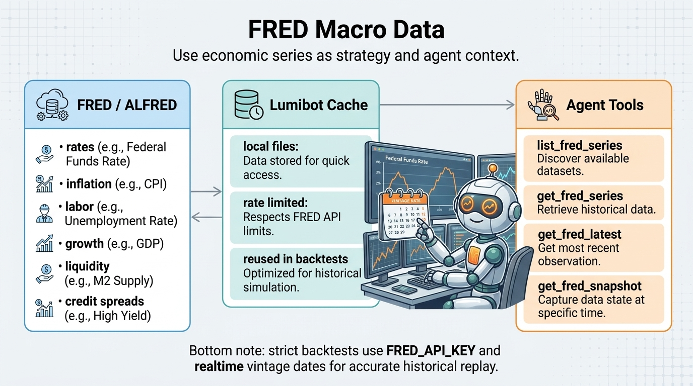

FRED Macro Data
===============

LumiBot includes native Federal Reserve Economic Data (FRED) macro tools for
strategies and AI agents. Use these tools for interest rates, inflation,
employment, growth, liquidity, credit spreads, and market-risk context.

Strategy API
------------

.. code-block:: python

   self.macro.list_series()
   self.macro.get_series("DGS10")
   self.macro.get_latest("UNRATE")
   self.macro.get_snapshot(["FEDFUNDS", "DGS10", "CPIAUCSL", "UNRATE"])

Agent Tools
-----------

Agents receive these built-ins automatically:

- ``list_fred_series``
- ``get_fred_series``
- ``get_fred_latest``
- ``get_fred_snapshot``

These tools are available to read-only research agents and trading-enabled
portfolio agents. They do not submit, cancel, or modify orders.

API Key Behavior
----------------

``FRED_API_KEY`` is required for the official FRED/ALFRED API path and for
all macro data fetches. LumiBot uses the official API path instead of public
CSV fallbacks so tool output has a clear provenance and backtests can request
point-in-time vintage observations.

With a key, LumiBot passes ``realtime_start`` and ``realtime_end`` based on the
strategy datetime so the backtest sees the vintage observations that were
available at that time.

Built-in FRED agent tools are hidden during backtests unless ``FRED_API_KEY`` is
configured. This prevents agents from accidentally using macro data without a
point-in-time data contract in historical simulations.

Backtest Date Safety
--------------------

In a backtest, ``as_of`` defaults to ``self.get_datetime()``.

LumiBot always filters observations to ``observation_date <= as_of`` and
requests the vintage data known as of that date through the official API.

Cache
-----

FRED data is cached under ``~/.lumibot/cache/fred`` by default. Override this
with ``LUMIBOT_FRED_CACHE_DIR``.

Cache lifetime depends on which **vintage** you requested, because a request's
cache key includes its as-of date:

.. list-table::
   :header-rows: 1
   :widths: 35 20 45

   * - Requested vintage
     - Expires after
     - Why
   * - Settled history (as-of older than yesterday)
     - never
     - What FRED reported as of a past date is immutable. Backtests replay these
       keys constantly, so they are cached permanently and cost one fetch ever.
   * - Current (as-of today or yesterday)
     - 1 hour
     - FRED publishes new observations and restates existing ones through the
       day, while the cache key stays identical.

The practical effect: backtests are unaffected and still fetch each series once,
while a live strategy picks up same-day releases and revisions instead of holding
a value cached earlier in the session.

If a cached copy has expired and FRED cannot be reached, LumiBot serves the
expired copy and logs a warning rather than failing, so an outage does not break
a run that would otherwise work offline. To force a full refresh, point
``LUMIBOT_FRED_CACHE_DIR`` at an empty directory.
